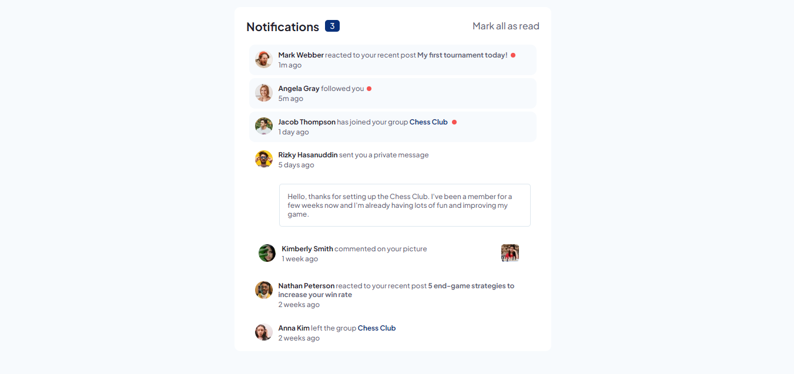

# Frontend Mentor - Notifications page solution

This is a solution to the [Notifications page challenge on Frontend Mentor](https://www.frontendmentor.io/challenges/notifications-page-DqK5QAmKbC). Frontend Mentor challenges help you improve your coding skills by building realistic projects. 

## Table of contents

- [Overview](#overview)
  - [Links](#links)
  - [Built with](#built-with)
- [Author](#author)

## Overview

### Links

- Solution URL: [Github Repo](https://github.com/obed-smart/notifications-page.git)
- Live Site URL: [Github Pages](https://obed-smart.github.io/notifications-page/)

### Built with

- Semantic HTML5 markup
- Sass
- vanilla javascript 

## Author

- Frontend Mentor - [@obed-smart](https://www.frontendmentor.io/profile/obed-smart)

